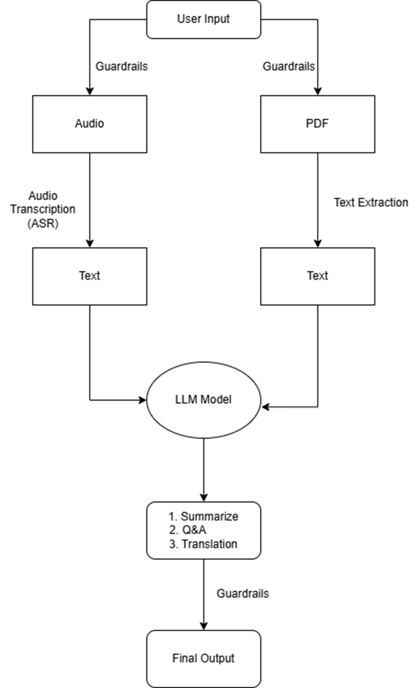

# Masters-Project

### **1️⃣ Project Title & Description**  
🔹 **Title:** `Medical Chatbot: AI-Powered Transcription, Summarization, and Q&A System`  
🔹 **Description:**  
   - A multimodal AI chatbot designed for the **medical field** that processes **audio and PDFs** to provide:  
     - ✅ **Medical Transcription** (ASR for doctor-patient conversations, prescriptions)  
     - ✅ **Summarization** (Extract key insights from medical documents & audio)  
     - ✅ **Multilingual Translation (including Braille)**  
     - ✅ **Interactive Medical Q&A**

---

### **2️⃣ Project Architecture**  

---

### **3️⃣ Features**  
✅ **Speech-to-Text Transcription**
✅ **Medical Text Summarization**  
✅ **Multilingual Translation (incl. Braille)**  
✅ **Interactive Q&A using LLM + RAG**  
✅ **Guardrails for Data Privacy**  
✅ **Scalable & Modular AI Architecture**  

---

## 4️⃣ OpenAI Whisper Fine-Tuning

Fine-tuning OpenAI Whisper is crucial for adapting the model to the specific needs of medical transcription. General ASR models may struggle with domain-specific terminology, abbreviations, and nuanced speech patterns used in doctor-patient conversations. By fine-tuning Whisper on medical audio data, we improve its ability to:
- Accurately transcribe medical terms and prescriptions.
- Reduce errors caused by complex jargon and accents.
- Enhance usability for real-world clinical applications.

Dataset used for Fine-tuning: https://www.kaggle.com/datasets/najamahmed97/audio-recording-whisper

Fine-tuning OpenAI Whisper enhances its transcription accuracy for medical terminology. The process involves:

- **Data Preparation:**
  - Audio recordings segmented into 30-second chunks.
  - Transcripts cleaned and normalized.
  - Dataset formatted for Hugging Face compatibility.

- **Model Configuration:**
  - Base Model: `openai/whisper-small`
  - Feature Extractor: Log-Mel spectrograms extraction.
  - Tokenizer: Text tokenization for ASR processing.

- **Preprocessing Steps:**
  - Removing special characters and standardizing text.
  - Splitting long audio files using **pydub**.
  - Applying **WhisperFeatureExtractor** and **WhisperTokenizer**.

This fine-tuning ensures better adaptation to specialized medical conversations, improving transcription reliability and usability.
